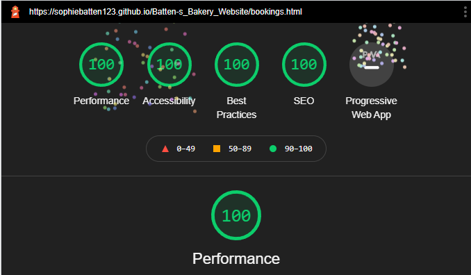

[Live Link]()

[GitHub Repository]()

# Overview

[Batten's Bakery]() is a Bakery Website aimed at enticing customers to book in for its famous afternoon tea. It promotes delicious cakes and scrumptious pastries with an added lockdown twist, allowing customers to bake their favourites whilst in the comfort of their own home. Batten's Bakery caters for many dietary requirements including vegetarian, vegan and gluten free options in all its recipes.

The site itself is fully responsive and designed in a simplistic and easy to navigate manner. It has been coded using solely HTML and CSS and therefore although it has 'form' elements on the website, due to no back-end functionality the entered fields will not be sent anywhere.

# UX 

## User Stories

### First Time Visitor Goals:
 - As a First Time Visitor, I should clearly understand the main purpose of the site and be wanting to know more about what Batten's Bakery has to offer.
 - As a First Time Visitor, I should be able to navigate easily around the site to find important information.
 - As a First Time Visitor, I should be able to easily access contact details and social media platforms for more information on what Batten's Bakery has to offer.

### Returning Visitor Goals:
- As a Returning Visitor, I should be able to easily navigate to the bookings page to reserve a table for afternoon tea.
- As a Returning Visitor, I should be notified of any new recipes after signing up for the exclusive newsletter.
- As a Returning Visitor, I should be able easily contact Batten's Bakery for any baking queries.

### Frequent User Goals:
- As a Frequent User, I want to be able to download the afternoon tea menu.
- As a Frequent User, I want to be able to check if there are any new recipes and be notified of this through the newsletter.
- As a Frequent User, I want to be able to challenge my baking skills and try more recipes catering for large groups.

# Design

## Colour Scheme

- The sites primary colours are green, cream, black and white. The image above displays the original colour scheme which was chosen for the website. It uses a wide range of pastel shades to create a soft texture to the website; whilst also ensuring that text is clear and readable. 

- The websites main text was written against a white background, this was due to the contrast created against the green border, making it stand out to the user on the page. 

- The colour palette was chosen and matched using [coolors.co](https://coolors.co/).

## Typography 

- The main font used throughout the whole website was 'Mate SC' with 'Sans Serif' as a fallback font. Alongside this font some handwritten text was included to create a personalised feel to the website and contrast nicely against the hard edges of 'Mate SC'. Both text styles are easy to read and suited the style of the website.

## Imagery

- The images on the website were carefully and deliberately chosen to blend with the colour scheme. The initial large heading image captures the user's attention whilst also working in unison with the rest of the page. Images on the recipe's pages were chosen to entice the user and therefore look delicious!

## Navigation Bar

- The navigation bar consistently appears on all the pages and contains links to the Home, Menu, Bookings and Recipes pages. Having this on every page allows the user to easily navigate around the website. When the user hovers over the navigation section a solid white line appears under the text and remains there on the 'active' webpage. This simplistic addition suits the elegance of the website as opposed to a solid background colour.

# Wireframes

To ensure efficiency in my coding of the website I created wireframes for each page to give an outline of what each page should look like and the layout of text and images. The links to these can be found below both for desktop and mobile devices:

## Desktop Wireframes

[Index-Page](assets/images/main_web_template.PNG)

[Menu-Page](assets/images/menu_web_template.PNG)

[Bookings-Page](assets/images/bookings_web_template.PNG)

[Recipes-Page](assets/images/recipes_web_template.PNG)

[Recipe-Steps-Pages](assets/images/recipessteps_web_template.PNG)

## Mobile Wireframes
 
[Index-Page](assets/images/main_phone_template.PNG)

[Menu-Page](assets/images/menu_phone_template.PNG)

[Bookings-Page](assets/images/bookings_phone_template.PNG)

[Recipes-Page](assets/images/recipes_phone_template.PNG)

[Recipe-Steps-Pages](assets/images/recipessteps_phone_template.PNG)

Some alterations were made from the original wireframe designs to improve User Experience (UX). These include:

- Padding colours were used in between each section of the website to create consistency between each section.
- The menu section was split into 3 parts ensuring users were not overwhelmed with solid text.
- Above the 'Our Cakes' section a heading was added giving users understanding of what the section was about and a link created below.

# About Us Section

## Welcome

- The Welcome Section of the site introduces users to Batten's Bakery and gives a personalised feel to the website containing a handwritten welcome message and signature. 
- Users are given the option to contact the company for more information. The button jumps to the footer of the page containing contact numbers and social media links.

# Customer Favourites Section

## Cake Strip

- The Customer Favourites Section is eye catching to the user and contains a strip of delicious cakes that are individually linked to the step-by-step recipe guide.
- Users should be drawn to this section of the website due to the vibrant use of colour against a neutral background. This should encourage them to either want to try the cakes fresh from the bakery or bake their own at home.

# Join Us Section

## Afternoon Tea

- The Join Us Section aims to entice the reader to book in for afternoon tea at Batten's Bakery. It contains information about what there is to offer along with testimonials from previous customers.
- Users are then given the option to reserve a table using a linked button to the bookings page.
- Images have been carefully selected to blend with the colours of the website whilst also being relevant to the section and encouraging the user to book.

# Newsletter Section

## Sign Up

- The Newsletter Section allows the user to sign up to Batten's Bakery giving them new recipes and discounts straight to their inbox. This section is responsible for enticing the user to revisit the site in the future; hence why it features on all the main pages on the website.

# Footer Section

## Social Media Platforms

- The Footer Section includes links to the relevant social media platforms. These links open in a new tab which allows easy navigation for the user and prevents them leaving the site.
- This is a valuable section of the website as it allows the user to view more testimonials and information about the bakery.

# Menu Section

- The Menu Section of the website allows the user to view the afternoon tea menu and provides the option to download it. This will allow the user to choose food and check dietary requirements before visiting the bakery.
- Users should be well informed as a result of this page and be interested in booking for afternoon tea.

# Bookings Section

- The Bookings Section includes a form which is editable to the user. It is simple to fill out and allows the user to select a time, date and specify the number of people attending (limited to 6 people).
- This section is easy to navigate making the user more likely to reserve a table.

# Recipes Section

- The Recipes Section contains 6 baking ideas for users to try at home. This section was made upon request of the client who wanted customers to have the option to bake from home whilst in lockdown.
- Each recipe contains a star rating, time frame and dietary requirements ensuring the customer's needs are met on each page.

# Baking Steps Sections

- The Baking Steps are split into 6 pages and can be viewed once the user selects a recipe.
- Each page is broken into ingredients and steps sections with the steps being ordered to ensure users do them sequentially.

# Future Features

- In the future Batten's Bakery would benefit from an online store enabling its customers to purchase pastries and cakes online. This feature would increase the number of visitors to the site and increase the number of orders at Batten's Bakery.

# Technology Used

# Testing

The website was tested thoroughly both manually and automatically.

## Manual Testing

Manual testing was done throughout the entire project and the website was continually tested on different browsers and screen sizes for errors within the code. Dev tools was initially used to amend errors allowing me to trial corrections before adding them onto Gitpod. 

I regularly generated lighthouse reports which gave me an indication on how well the webpage was performing. Initially when I ran lighthouse on my homepage, I had an issue with the images on the main page causing the site to load slowly on mobile devices, initially I resolved this by importing the main image as an AVIF file however upon inspection this made the image unreadable on Microsoft Edge - hence why I resorted back to the inital jpeg format. Furthermore, I also had an issue in which the hyperlinked text was not descriptive enough, this was resolved by adding more context to the link. Below is an example of a lighthouse report generated on my recipes.html page.

## Automatic Testing

Automatic testing of the HTML and CSS code was checked using [W3C Validator](https://validator.w3.org/) to ensure that there were no errors or warnings within the code. All pages were ran through the validator and no errors or warnings were present when the site was deployed. However, errors were found and fixed as a result of this software during the building stages of the website these include: 

- Error - ID element was used twice on one page. This was replaced with a class tag.
- Error - Alt tag was a child of a hyperlink tag. This was removed.
- Warning - Heading tags were children of span tags. This was fixed by replacing span tags with div tags.
- Warning - Section contained no heading tag. Heading tag was added although hidden to suit the design of the webpage.

Below is a screenshot of the HTML and CSS validator for my index.html page. This shows no errors or warnings when the website was deployed.

## WAVE Testing

Alongside checking my code was free from coding errors I also used [WAVE](https://wave.webaim.org/) to check the accessibility of my website specifically aimed at people with disabilities. This was an extremely useful tool as it highlighted errors and warnings that could hinder the use of the website to people with impaired vision. More specifically these include:

- Error - Icons were children of heading tag making the content difficult to understand for impaired readers. Icons were contained in span tags and removed from heading tags.
- Error - Label was missing from the sign-up section. Label was added although hidden to suit the design of the webpage.

All errors were removed as a result of using this software. 

# Deployment

The website was deployed through GitHub pages and accessible through the following steps:

- Start within the GitHub repository and then navigate to the settings tab.
- From the settings selection choose the pages tab.
- Select the Master Branch and the page will automatically be opened with a detailed ribbon display containing the site link.

The live link to the website can be found here: [https://sophiebatten123.github.io/Batten-s_Bakery_Website/index.html](https://sophiebatten123.github.io/Batten-s_Bakery_Website/index.html)

# Credits

## Content

- The recipes included on the website were not written myself and instead were taken from recipe websites including: [Veganonboard](https://veganonboard.com/), [Lovingitvegan](https://lovingitvegan.com/) and [BBC-Good-Food](https://bbcgoodfood.com).
- The icons included throughout the website were taken from [Font-Awesome](https://fontawesome.com/).
- Colour themes were chosen using [Coolors](https://coolors.co/).
- Help and support was provided for the layout of the recipes section of my website from the Code Institute Tutors.

## Media

- Images were free stock photos taken from [Pexels](https://www.pexels.com/).
- Instructions on how to make the polygon cover text strip was taken from Razvan Caliman's article [CSS-Shapes](https://www.html5rocks.com/en/tutorials/shapes/getting-started/).

Thank you to the tutors at Code Institute for helping and supporting me throughout this project.